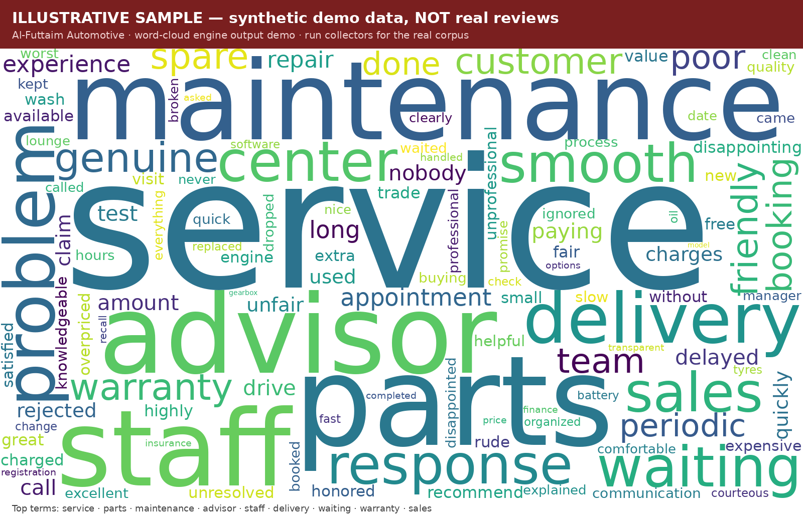

# Al-Futtaim Automotive — Review Word Cloud Pipeline

Collect **every** Google Maps + Reddit review for Al-Futtaim Automotive (Toyota,
Lexus, Honda, Volvo, BYD, Jeep/Dodge/RAM, Automall) across the UAE and build a
word cloud of the most-used words.

This is a complete, runnable pipeline. It is split into **collectors** (which
need a data provider key and internet access) and a **source-agnostic word-cloud
engine** (which runs anywhere). A labeled synthetic demo is included so you can
see the output immediately.



> The image above is a **synthetic demonstration**, not real review data. The
> real cloud is produced by running the collectors below.

---

## ⚠️ Read this first: why "every single review" needs a paid provider

The brief was *"every single review, all the data, accuracy is key."* Here is the
unavoidable reality, so the numbers you get are trustworthy:

1. **Google's official Places API returns at most 5 reviews per location.** There
   is no official way to pull a location's full review history. To get *all*
   reviews you must use a scraping provider (Apify / Outscraper / SerpApi). This
   costs a few dollars and is technically against Google's ToS — your call.
2. **Reddit** search returns a bounded, recency-weighted set per query. For deep
   historical coverage, plug in an archive backend (see `collect_reddit.py`).
   Note r/dubai only dates to ~2010, so "last 20 years" effectively means "all
   available history."
3. **This pipeline cannot run inside the Claude Code web sandbox.** That
   environment's egress proxy only allows package registries + Anthropic;
   `api.apify.com`, `api.outscraper.com`, `serpapi.com`, and `reddit.com` all
   return `403 (policy denial)`. **Run it on your laptop or CI**, where it works
   normally.

The word-cloud engine itself runs anywhere (it's pure local compute).

---

## Quickstart

### 0. Install
```bash
cd reviews-wordcloud
make install            # or: pip install -r requirements.txt
```

### 1. See it work right now (no keys, no network)
```bash
make demo               # generates synthetic data -> output/wordcloud.png
```

### 2. Real collection
Get a key for **one** Google provider, plus Reddit API credentials:

| Provider     | Env var               | Notes                                   | Rough cost\* |
|--------------|-----------------------|-----------------------------------------|--------------|
| **Apify**    | `APIFY_TOKEN`         | cheapest for reviews, ~$0.40 / 1k       | ~$10–25      |
| Outscraper   | `OUTSCRAPER_API_KEY`  | `reviewsLimit=0` = all reviews          | ~$20–40      |
| SerpApi      | `SERPAPI_KEY`         | ~10–20 reviews/page, easy REST          | ~$25–40      |

Reddit: create a "script" app at <https://www.reddit.com/prefs/apps>:
```bash
export REDDIT_CLIENT_ID=...  REDDIT_CLIENT_SECRET=...
export REDDIT_USER_AGENT="alfuttaim-reviews by u/you"
```

\* The UAE network is typically **~20,000–60,000 reviews** across 50+ locations.
`make enumerate` prints the exact approximate total before you spend anything.

```bash
export APIFY_TOKEN=...                       # pick your provider
make enumerate                               # discover all locations + place_ids
make google PROVIDER=apify PLACES=config/places.discovered.json
make reddit
make wordcloud                               # builds from everything in data/
open output/wordcloud.png
```

---

## What each piece does

```
config/
  places.json              hand-verified SEED locations + official source URLs
  places.discovered.json   (generated) full location list with place_ids
  stopwords_extra.txt      English meta-noise to drop (keeps content words!)
  arabic_stopwords.txt     Arabic function words to drop
src/
  enumerate_places.py      discover ALL Al-Futtaim locations via the provider
  collect_google.py        all Google reviews, full pagination (apify|outscraper|serpapi)
  collect_reddit.py        Reddit posts + full comment trees via PRAW
  build_wordcloud.py       load -> clean -> tokenize (EN+AR) -> frequencies -> PNG/CSV
  common.py                shared JSONL schema + dedup
data/
  reviews.sample.jsonl     SYNTHETIC demo corpus (not real data)
  *.jsonl                  (generated) real collected reviews
output/
  wordcloud.png            the cloud
  frequencies.csv          every term + count (full ranked list)
  stats.json               counts, avg rating, date range, per-brand/source breakdown
```

## Methodology (how accuracy is protected)

- **One schema, deduped.** Every collector writes the same JSONL record; the
  engine de-duplicates on `source + author + text-head` so a review counted once.
- **Languages.** English and Arabic are tokenized separately with their own
  stopword lists. Arabic frequencies are always recorded; they only render in the
  PNG if you supply an Arabic font (`--font NotoNaskhArabic-Regular.ttf`).
- **Stopwords keep the signal.** Only filler (`the`, `very`, `i`) and review
  meta-noise (`star`, `rating`) are removed. Content words — `service`, `staff`,
  `waiting`, `delivery`, `warranty`, `parts` — are intentionally kept.
- **Brand/geo terms** (`toyota`, `dubai`, `showroom`) are removed by default so
  they don't swamp the cloud; pass `--include-brands` to keep them.
- **Date window.** `--since 2006-01-01 --until ...` filters to your 20-year (or
  any) window. Undated reviews are kept, not silently dropped.
- **Nothing is fabricated.** If a step can't reach data it errors loudly rather
  than inventing reviews.

## Engine options
```bash
python src/build_wordcloud.py data/ --out output \
  --since 2006-01-01 --until 2026-06-28 \
  --max-words 250 --ngram 2 \           # 2 = also count bigrams (e.g. "customer service")
  --include-brands \                    # keep toyota/lexus/... in the cloud
  --font /path/to/NotoNaskhArabic-Regular.ttf   # render Arabic words
```

## Scope covered
Al-Futtaim Motors (Toyota, Lexus, Hino), Trading Enterprises (Honda, Volvo, Jeep,
Chrysler, Dodge, RAM), Al-Futtaim Automall, and BYD — all UAE emirates. Edit
`config/places.json` `reddit_targets` / `BRAND_QUERIES` to widen or narrow.
